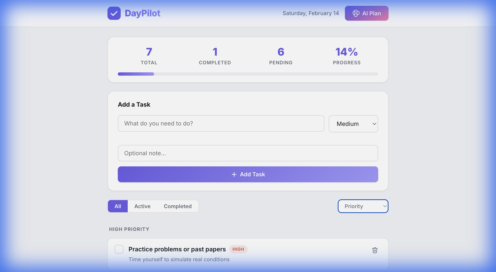
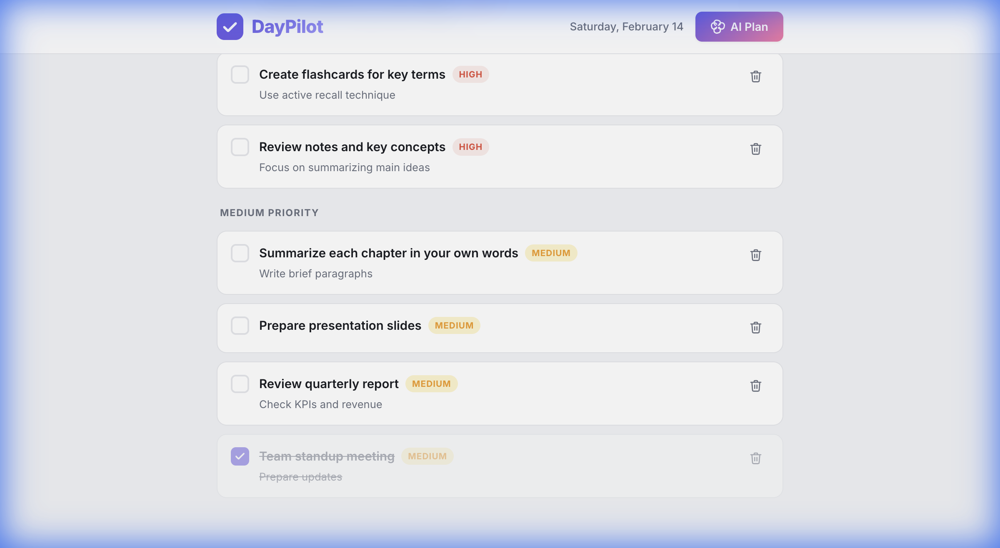
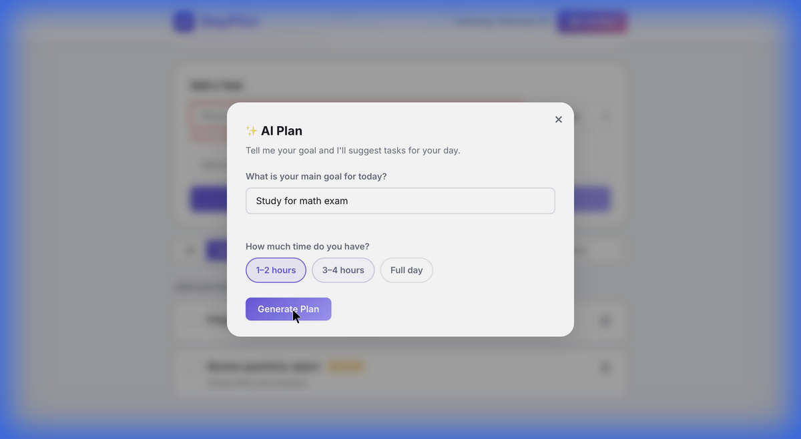
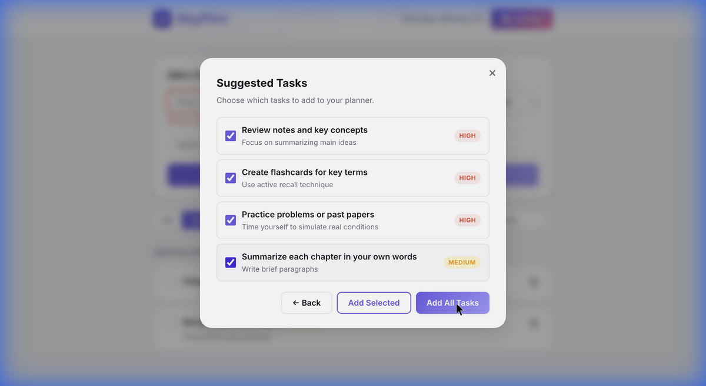
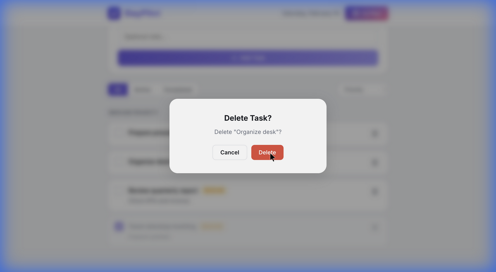

# DayPilot — Project Report

## 2. ✅ What App I Built & Why

**DayPilot** is a modern, fully client-side **Daily Planner** web application designed to help users organize tasks, set priorities, and track their daily progress — all in the browser with zero backend.

### Why I Built It

The goal was to create a **simple but powerful** productivity tool that:
- Helps users structure their day with clear priorities (High / Medium / Low)
- Provides instant visual feedback on progress through a live dashboard
- Works offline with no login, no server, and no external dependencies
- Includes a smart **AI Plan** feature that generates tasks from a natural-language goal

### Key Features

| Feature | Description |
|---|---|
| **Task Management** | Add, complete, and delete tasks with titles, priorities, and optional notes |
| **Priority Grouping** | Tasks are displayed grouped by High → Medium → Low priority |
| **Dashboard** | Live counters (Total, Completed, Pending) and an animated progress bar |
| **Filters & Sorting** | Filter by All / Active / Completed; sort by Priority or Newest |
| **AI Plan** | Describe your goal + time budget → auto-generated task suggestions |
| **Data Persistence** | All tasks stored in `localStorage` — survives page refresh |
| **Delete Confirmation** | Safety dialog before any deletion |
| **Responsive Design** | Works on both desktop and mobile screens |
| **Animations** | Smooth slide-in on add, fade-out on delete, modal transitions |

### Tech Stack

- **HTML5** — Semantic markup, accessibility attributes
- **CSS3** — Custom properties, glassmorphism, gradient accents, keyframe animations
- **Vanilla JavaScript** — State-driven rendering, IIFE architecture, no frameworks
- **Google Fonts** — Inter typeface for clean typography
- **No build step** — Just open `index.html` or serve with any static server

### Repository

🔗 [github.com/Jash-Khunt/task1-daypilot](https://github.com/Jash-Khunt/task1-daypilot)

---

## 3. ✅ Screenshot of the App

### App Overview — Header, Dashboard, Task Form

### Task List — Grouped by Priority

### AI Plan — Goal Input & Generated Suggestions

### Delete Confirmation Dialog

---

## 4. ✅ How Long It Took

| Phase | Duration |
|---|---|
| **Planning** | ~2 minutes |
| **Implementation** (HTML + CSS + JS + README) | ~10 minutes |
| **Testing & Verification** (browser testing all features) | ~5 minutes |
| **Total** | **~17 minutes** |

**Timeline:**
- **Started:** 11:54 PM IST (Feb 13, 2026)
- **Finished:** 12:11 AM IST (Feb 14, 2026)

The entire app — including all 12 features, responsive design, animations, AI Plan engine, and full browser verification — was built and tested in approximately **17 minutes**.
